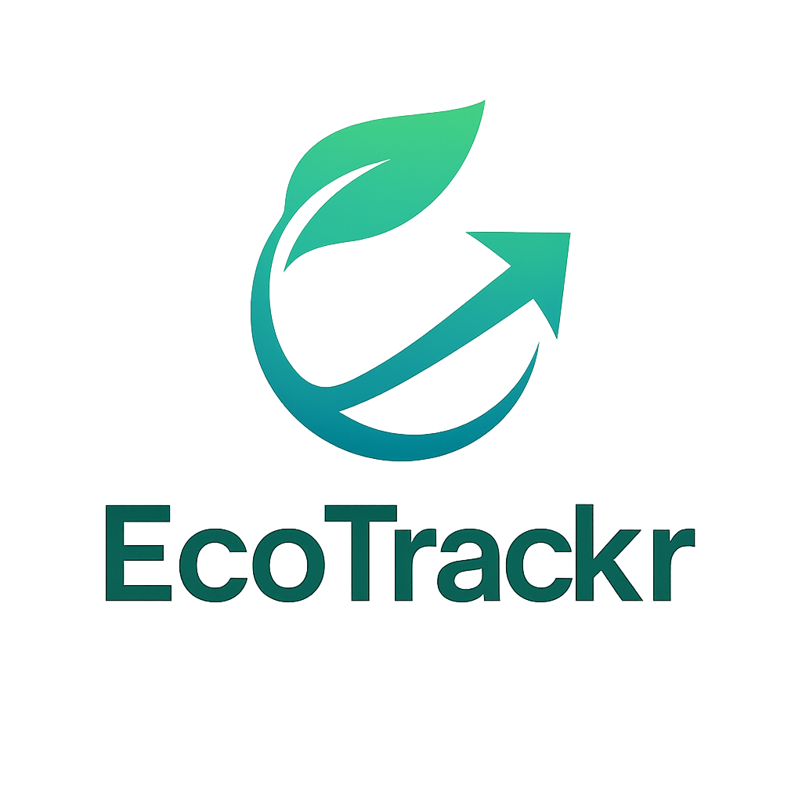

# EcoTrackr — Personal Carbon Footprint Tracker (Portfolio)

  

> This public repository intentionally does not include the mobile app source code. It provides a product overview, a data notebook, and a technical summary for recruiters/partners. The full codebase is private and can be shared upon request (NDA/prior agreement).

• App Store: https://apps.apple.com/fr/app/ecotrackr/id6751150543

## Table of Contents
- [Product Overview](#product-overview)
- [Key Features](#key-features)
- [Architecture](#architecture)
- [Mobile Tech Stack](#mobile-tech-stack)
- [APIs and External Data](#apis-and-external-data)
- [Analysis Notebook](#analysis-notebook)
- [Privacy & Security](#privacy--security)
- [License & Contact](#license--contact)

## Product Overview
EcoTrackr is a mobile app that helps users track and reduce their daily carbon footprint. It computes indicators (kg CO₂e per week/month/overall), displays a dashboard, and relies on official emission factors.

## Key Features
- Carbon dashboard with KPIs (week, month, category)
- Activity input/management (housing, transport, etc.)
- Automatic dashboard refresh after adding an activity
- Polished “no data” state to guide the first‑run experience
- Authentication: Email/Password, Google, Apple (iOS)
- Persistent session (no need to sign in at every launch)
- Local notifications (reminders, iOS/Android)

## Architecture
- Mobile app: Flutter (Dart 3), modular by screens/services
- Storage: SQLite (local tracking), Shared Preferences (settings), Cloud Firestore (sync)
- Authentication: Firebase Auth (email, Google, Apple)
- iOS: Sign in with Apple, Google Sign‑In, Firebase configuration

## Mobile Tech Stack
Main dependencies (excerpt):
- UI & utilities: `flutter`, `cupertino_icons`, `intl`, `path`
- Local storage: `sqflite`, `shared_preferences`
- Auth & Cloud: `firebase_core`, `firebase_auth`, `google_sign_in`, `sign_in_with_apple`, `cloud_firestore`
- Charts & data UI: `fl_chart`, `webview_flutter`
- Notifications & time: `flutter_local_notifications`, `timezone`
- Config & networking: `flutter_dotenv`, `http`, `crypto`

## APIs and External Data
- ADEME — Base Carbone®: official emission factors (datasets)
- Climatiq API: complementary factors/methodologies (optional)
- Impact CO₂ API: public educational resources (optional)
- Google/Firebase: Google Auth, Firestore (sync), mobile services
- Apple: Sign in with Apple (iOS)

> Note: secrets, keys and sensitive files (e.g. `.env`, `GoogleService-Info.plist`) are not present in this public repo.

## Analysis Notebook
- File: `notebook.ipynb`
- Content: project summary, ADEME data exploration, emission factors, “Transactions Exploration” section, KPIs, charts, paginated table
- Quick start:
  1. Python 3.10+
  2. Install libs: `pandas`, `numpy`, `matplotlib`, `seaborn`, `requests`, `python-dotenv`, `ipywidgets`, `tqdm`
  3. Open: `jupyter notebook notebook.ipynb`

## Privacy & Security
- No secrets, tokens or private configuration files are published
- The full source code remains private

## License & Contact
- License: see [LICENSE](LICENSE)
- Privacy: see [PRIVACY.md](PRIVACY.md)
- Repository content license: © 2025 EcoTrackr — All rights reserved
- TestFlight/demo or private code access: on request
- Contact: saidrazdine@gmail.com

<!-- The default Flutter README scaffold was removed for clarity in this public portfolio. -->
